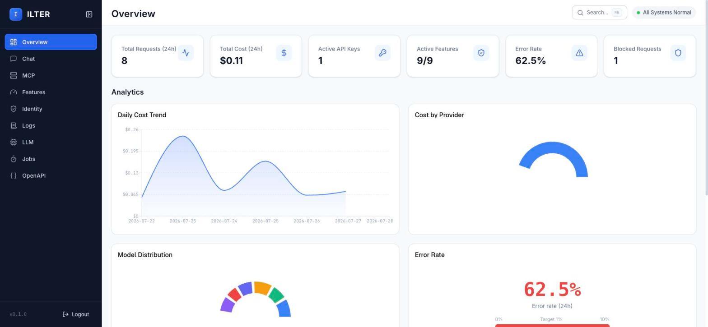
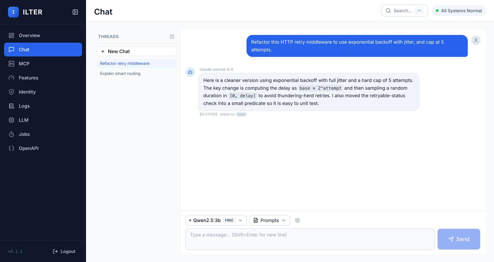
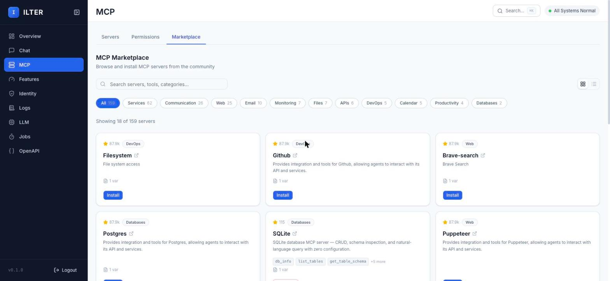
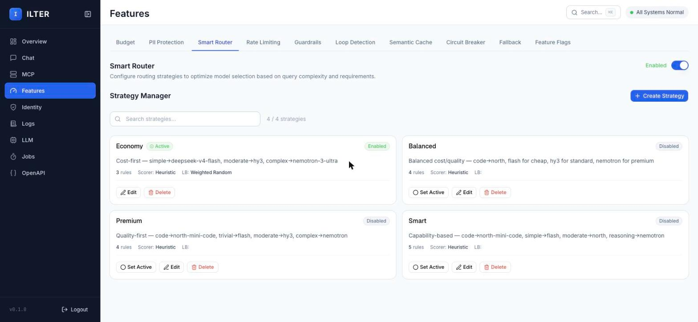
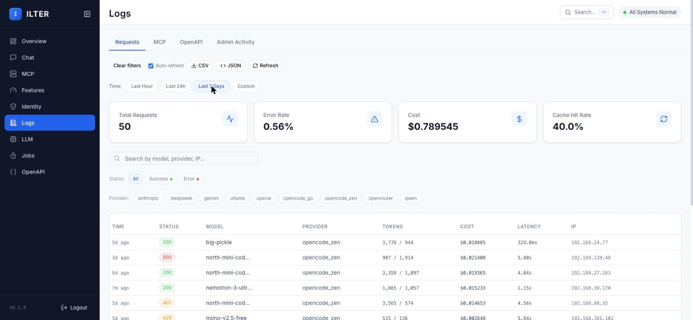
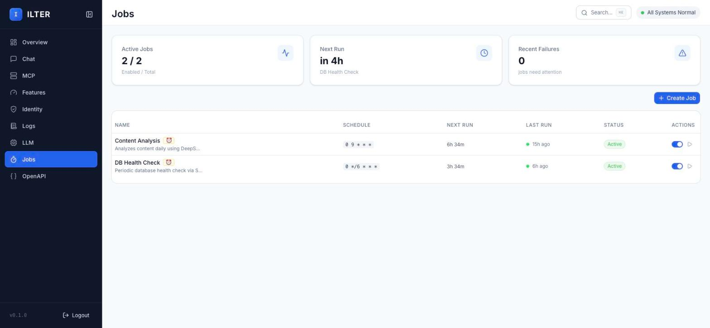

#  ILTER — AI Gateway

[](https://hub.docker.com/r/ykocaman/ilter)
[](https://hub.docker.com/r/ykocaman/ilter)
[](https://hub.docker.com/r/ykocaman/ilter)
[](https://github.com/ilter-ai/ilter/releases)
[](go.mod)
[](LICENSE)

Deploying AI models to production brings critical operational challenges such as unpredictable costs, data privacy risks, and API outages. **ILTER** is an independent gateway that sits between your application and AI providers; transforming your entire AI traffic into a secure, optimized, and fully controlled infrastructure without requiring any architectural changes in your code.

*   🧩 **MCP Gateway & Marketplace:** Connect AI to your APIs, CRM, or MCP servers — zero changes required.
*   ⚡ **Smart Router:** Every request is scored for complexity in real time and routed to the right model tier.
*   🌐 **Smart Fallback:** Provider down or rate-limited? ILTER fails over to another key or provider, no changes.
*   💰 **Budget Control:** Hard daily/monthly spending limits per key — traffic cuts off the instant a limit is hit.
*   🪪 **PII Guard:** Emails, SSNs, and other sensitive data are masked before they ever leave your network.
*   🧠 **Semantic Cache:** Queries are served from cache — vector search with SHA-256 exact-match fallback.
*   🛡️ **Prompt Guardrails:** Blocks injection, toxic content, and off-topic requests before they reach the model.
*   🌀 **Agent Loop Detector:** Catches loops by rate, fingerprint, cost, or depth before burning budget.
*   ⏱️ **Cron Engine:** Schedule recurring AI workflows with standard cron expressions — no external queue needed.
*   📡 **Observability:** Prometheus metrics and OpenTelemetry tracing, ready for Grafana, Datadog, or Honeycomb.
*   📊 **Dashboard:** Embedded web UI for KPIs, audit logs, API keys, and built-in chat playground — no server.

> All this infrastructure requires no external server, Node.js/Python environment, or complex dependencies. **It comes as a zero-setup, single static executable (binary) ready to run in seconds.**

**[⬇️ Download the latest release](https://github.com/ilter-ai/ilter/releases)**

```bash
./ilter serve
# Proxy: http://localhost:8181/v1/chat/completions
# Dashboard: http://localhost:9191
# Metrics: http://localhost:9192/metrics
```

---

## Dashboard

<table>
  <tr>
    <td width="33%">
      
      <br /><strong>Overview</strong><br />
      Live KPIs, daily cost trend, provider/model breakdown, and a one-click toggle hub for every feature.
    </td>
    <td width="33%">
      
      <br /><strong>Chat</strong><br />
      Built-in playground to test prompts against any registered model without leaving the dashboard.
    </td>
    <td width="33%">
      
      <br /><strong>MCP Marketplace</strong><br />
      Browse and one-click install community MCP servers — filesystem, GitHub, Postgres, and more.
    </td>
  </tr>
  <tr>
    <td width="33%">
      
      <br /><strong>Smart Router</strong><br />
      Manage routing strategies — cost-first, quality-first, or custom rules — and switch the active one live.
    </td>
    <td width="33%">
      
      <br /><strong>Logs</strong><br />
      Full request history with cost, latency, and status, filterable by time range and provider.
    </td>
    <td width="33%">
      
      <br /><strong>Jobs</strong><br />
      Cron-scheduled AI workflows with next/last run status, right from the embedded scheduler.
    </td>
  </tr>
</table>

---

## Features

Every business integrating AI faces uncontrolled costs, privacy concerns, and unpredictable agent behaviors. ILTER solves these directly at the gateway level.

### 🧩 MCP Gateway & Marketplace
Connecting AI to your internal APIs or CRM usually requires heavy client-side modifications.
- **Zero Client Changes:** Automatically injects tools from registered MCP servers into every chat completion request.
- **Interception:** ILTER catches the `tool_call`, executes the MCP server tool locally (`stdio`/SSE), and returns the result to the model.
- **OpenAPI Bridge:** Convert any REST API to an MCP tool list instantly.
- **OAuth PKCE Support:** Standard OAuth PKCE authorization endpoints (`/.well-known/*`, `/authorize`, `/token`, `/register`) on port `8181` for remote MCP clients.

### ⚡ Smart Router
Using expensive models for every simple question wastes engineering time and money. ILTER routes requests dynamically based on context.
- **Real-Time Scoring:** `<0.03ms` heuristic complexity score (0–100) based on word count, reasoning-required phrases, code blocks, and tool calls.
- **Automatic Tier Selection:** Routes dynamically between economy, standard, and premium models.
- **Custom Overrides:** E.g., `complexity > 50 → gpt-4o` or `prompt contains "analyze" → claude-sonnet`.
- **Load Balancing:** Weighted round-robin, cost-optimized, latency-optimized, and priority-based strategies across healthy provider circuits.

### 🌐 Smart Fallback
Don't get locked into a single vendor or disrupted by provider outages. 
- **Single Endpoint:** Hides 9 providers behind one uniform OpenAI-compatible API.
- **Circuit Breaker:** `RetryTransport → CircuitBreakerTransport`. 5 consecutive failures open the circuit and trigger automatic fallback.
- **Seamless Failover:** Switching from OpenAI to Anthropic during an outage requires zero code changes.

### 🧠 Semantic Cache
- **Vector Search:** Redis Stack-backed similarity search to catch and serve repetitive queries.
- **Exact-Match Fallback:** SHA-256 caching works even without an embedding model.
- **Async Operations:** Cache writing does not block the primary request path.

### 🛡️ Prompt Guardrails
- **Security:** Prompt injection detection and toxicity filtering.
- **Topic Control:** Keyword-based and custom regex rules to block specific topics.
- **Actions:** Set per-rule severity to `block`, `warn`, or `mask`.

### 💰 Budget Control
Per-token pricing creates end-of-month surprises. ILTER tracks costs in real-time for each API key and enforces hard limits.
- **Hard Kill Switch:** Configurable daily and monthly spending limits (USD). Returns `429 budget_exceeded` the millisecond the limit is breached.
- **Warning Thresholds:** Default 80% usage alerts.
- **Real-time Tracking:** Cost breakdowns by model, provider, and individual keys via the dashboard.

### 🪪 PII Guard
Sending customer data to cloud providers violates GDPR and HIPAA. ILTER masks this data before it ever leaves your network.
- **Triple-Layer Engine:** Bloom Filter + Aho-Corasick Trie + Regex working together.
- **Detected Types:** Names (EN/TR), Emails, Phones, SSN/National IDs (TCKN), Credit Cards (Luhn validated), IPs.
- **Three Modes:** Mask (`[PII_EMAIL]`), Reversible (`PII:EMAIL:a8b9f1` — restored in response/SSE stream), or Block (`422 pii_blocked`).
- **Ultra-Fast:** `<0.04ms` latency overhead with `<5MB` memory footprint.

### 🌀 Agent Loop Detector
Agentic workflows can enter infinite loops, generating massive bills overnight. ILTER catches them while you sleep.
- **Rate Limit:** Blocks if >30 requests/sec.
- **Fingerprint Match:** Blocks if the exact same prompt is sent >5 times in a 20-request window.
- **Cost Accumulation:** Blocks if >$5 is spent within 5 minutes on a single session.
- **Session Depth:** Throttles if a single session exceeds 100 requests.

### ⏱️ Cron Engine
Running periodic AI tasks (summaries, reports) usually requires external queues and workers. ILTER embeds this directly in the binary.
- **No External Queue:** Uses standard cron expressions (e.g., `0 9 * * 1`).
- **Workflow State:** Pass data between steps using `{{.Input}}` and `{{.prev}}`.
- **Robust Execution:** Webhook triggers, exponential backoff, and dead-letter queues included.

### 📡 Observability
- **Metrics:** Native Prometheus metrics on `/metrics` (Port `9192`).
- **Tracing:** OpenTelemetry (OTLP push) ready for Grafana Cloud, Datadog, or Honeycomb.
- **Audit Logs:** Full request logs, cost trends, and PII event indicators.

### 📊 Others
No npm, no build step, no separate server. A modern web UI embedded directly into the Go binary via `embed`.
- **Overview:** KPIs, monthly spend, routing decisions, and feature toggle hub.
- **Chat Playground:** Use any registered model directly from the dashboard.
- **Management:** Create API keys, configure thresholds, register MCP servers, and manage Cron jobs. (Accessible at Port `9191`).

---

## Quickstart

```bash
# Requires nothing — it just works
./ilter serve
```

For the interactive setup wizard:
```bash
./ilter init
```

To see the dashboard filled with mock costs, requests, and PII events:
```bash
./ilter init --demo && ./ilter serve
```

Your first real request (Point your existing OpenAI SDK to ILTER):
```bash
curl -X POST http://localhost:8181/v1/chat/completions \
  -H "Authorization: Bearer <ilter-api-key>" \
  -H "Content-Type: application/json" \
  -d '{"model": "gpt-4o-mini", "messages": [{"role": "user", "content": "Hello!"}]}'
```

---

## Supported Providers

| Provider | Notes |
|----------|--------|
| **OpenAI** | Native format |
| **Anthropic** | System message extraction, content block conversion |
| **Google Gemini** | OpenAI-compatible mode |
| **DeepSeek** | OpenAI-compatible |
| **OpenRouter** | `HTTP-Referer` + `X-Title` headers automatically injected |
| **Ollama** | Local inference, OpenAI-compatible mode |
| **Qwen (Alibaba)** | OpenAI-compatible, model name mapping |
| **OpenCode** | `opencode_go` and `opencode_zen` SDK endpoint mapping |
| **Mock** | Built-in mock provider for local testing |

---

## Architecture

```text
Your Application
    │  OpenAI API format
    ▼
ILTER :8181
    │
    ├─ Auth              — ilter-xxxx key (Argon2id/SHA-256 + LRU cache)
    ├─ Rate Limiter      — Redis / in-memory token bucket, RPM/TPM per key
    ├─ Budget Enforcer   — Monthly spend limit, hard reject
    ├─ Prompt Injection  — Inject system prompts from DB
    ├─ PII Masker        — Bloom + Aho-Corasick + Regex, <0.04ms
    ├─ Guardrails        — Injection detection, topic blocking
    ├─ MCP Inject        — Tool injection + tool_call interception + OAuth PKCE
    ├─ Smart Router      — Real-time complexity scoring & tier selection
    ├─ Loop Detector     — Rate / fingerprint / cost / session
    ├─ Semantic Cache    — Redis Stack vector search + SHA256 fallback
    └─ Provider Router   — Weighted round-robin, circuit breaker, fallback
           │
           ├─ OpenAI / Anthropic / Gemini / DeepSeek
           ├─ OpenRouter / Ollama / Qwen / OpenCode
           └─ ...

ILTER :9191  →  Dashboard (Astro + React, Go embed)
ILTER :9192  →  /metrics  (Prometheus, OpenTelemetry bridge)
```

- **Language:** Go 1.26.3, single binary, CGo-free (`CGO_ENABLED=0`), goroutine concurrency.
- **Router:** `chi` v5.
- **Database:** SQLite — `modernc.org/sqlite`, pure Go, WAL mode.
- **Cache:** Redis Stack 7+ — optional, graceful degradation.
- **Config:** Compiled defaults + `ILTER_*` env vars — no configuration file required.

→ Architecture details: [`docs/architecture.md`](docs/architecture.md)  
→ Design decisions & FAQ: [`docs/faq.md`](docs/faq.md)  
→ Gateway comparison: [`docs/comparison.md`](docs/comparison.md)

---

## Docker & Container Deployment

```bash
# Single container (scratch-based image, <20MB)
# Admin key + a provider key are enough to boot straight into `serve` — no
# `ilter init` step needed. The SQLite DB is created on first start, and the
# provider whose ILTER_PROVIDER_<NAME>_API_KEY is set is enabled automatically.
docker run -d \
  -p 8181:8181 -p 9191:9191 -p 9192:9192 \
  -v $(pwd)/data:/app/data \
  -e ILTER_ADMIN_API_KEY=<your-own-random-secret> \
  -e ILTER_PROVIDER_OPENAI_API_KEY=sk-... \
  ykocaman/ilter:latest

# Full local stack: ILTER + Redis Stack + Ollama
docker compose up -d
```

Without `ILTER_ADMIN_API_KEY` and a provider key both set, `serve` refuses to start — there'd be no way to authenticate or route requests — and exits with a message telling you to run `ilter init` or set both.

Image size: **<20MB** (3-stage build: Bun web → Go UPX → empty `scratch` base image). This applies to the Docker image specifically — the plain binary from [Releases](https://github.com/ilter-ai/ilter/releases) (no UPX) is ~35-40MB.

---

## Configuration

Zero configuration by default. Three levels of overrides:

| Level | Method | Example |
|--------|--------|-------|
| **Boot** | `ILTER_*` env vars | `ILTER_SERVER_PORT=9090`, `ILTER_METRICS_LISTEN_ADDR=:9192` |
| **Runtime** | Dashboard or `ilter init` wizard | Toggle PII, add providers, update routing strategies |
| **Per-key** | Dashboard or Admin API | Team-based budget, rate limit, allowed models |

→ All options: [`docs/configuration.md`](docs/configuration.md)

---

## CLI

| Command | Description |
|-------|---------|
| `ilter serve` | Start proxy + dashboard |
| `ilter init` | Interactive setup wizard |
| `ilter init --demo` | Dashboard demo with mock data |
| `ilter models` | Supported models — provider, tier, cost |
| `ilter models --update` | Model discovery from all providers |

---

## Development

```bash
make build      # Go binary + web assets
make check      # Build + lint (Go + web)
make test       # go test -race -count=1 ./...
make fix        # gofumpt + biome format
```

Contribution guidelines: [`CONTRIBUTING.md`](CONTRIBUTING.md)

---

## Performance

Apple M4, Go 1.26.3:

| Operation | Latency |
|-------|---------|
| Core proxy overhead | <0.8ms |
| PII Guard scan | 0.031ms |
| Smart Router scoring | 0.022ms |
| Loop fingerprinting | 0.008ms |

---

## License

Apache 2.0 with Commons Clause — see [LICENSE](LICENSE).