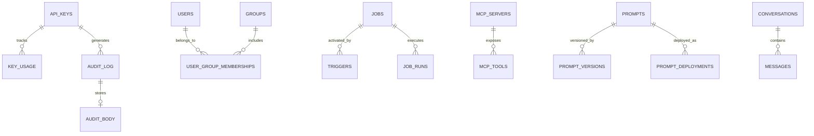

# ILTER System Architecture

> How the pieces fit together, technology choices, and how a request flows through the system.

---

## High-Level Design

ILTER is a **single-binary reverse proxy** built in Go 1.26.3 (`CGO_ENABLED=0`) with embedded Astro + React dashboard:

```
                            ┌──────────────────────────────────────────┐
                            │              ILTER (single binary)        │
                            │                                           │
    Client                  │  ┌──────────────────────────────────┐    │
    (SDK / CLI / app)       │  │         Proxy Server (:8181)      │    │
        │                   │  │                                    │    │
        │  POST /v1/chat    │  │  ┌──────────────────────────────┐ │    │
        ├──────────────────►│  │  │     Middleware Chain          │ │    │
        │                   │  │  │  Auth → Rate → Budget →      │ │    │
        │                   │  │  │  PromptInj → PII →           │ │    │
        │                   │  │  │  Guardrails → MCP Inject →   │ │    │
        │                   │  │  │  SmartRouter → LoopDetect →  │ │    │
        │                   │  │  │    Cache → Router             │ │    │
        │                   │  │  └──────────────────────────────┘ │    │
        │                   │  │                  │                 │    │
        │                   │  │                  ▼                 │    │
        │                   │  │  ┌──────────────────────────────┐ │    │
        │                   │  │  │    Provider Adapter Layer     │ │    │
        │                   │  │  │  OpenAI │ Anthropic │ DeepSeek│ │    │
        │                   │  │  │  Gemini │ Ollama   │ OpenRoute│ │    │
        │                   │  │  │  Qwen   │ OpenCode │ Mock     │ │    │
        │                   │  │  └──────────────────────────────┘ │    │
        │                   │  │                  │                 │    │
        │                   │  │                  ▼                 │    │
        │                   │  │  ┌──────────────────────────────┐ │    │
        │                   │  │  │   Circuit Breaker + LB        │ │    │
        │                   │  │  └──────────────────────────────┘ │    │
        │                   │  └──────────────────────────────────┘    │
        │                   │                                           │
        │                   │  ┌──────────────────────────────────┐    │
        │                   │  │     Dashboard Server (:9191)      │    │
        │                   │  │     (Embedded Web UI)             │    │
        │                   │  │  Overview, Costs, Keys, Logs,    │    │
        │                   │  │  Guardrails, PII, Loops, MCP,    │    │
        │                   │  │  Cron Jobs, Smart Router         │    │
        │                   │  └──────────────────────────────────┘    │
        │                   │                                           │
        │                   │  ┌──────────────────────────────────┐    │
        │                   │  │     Prometheus Metrics (:9192)   │    │
        │                   │  │     OpenTelemetry /metrics       │    │
        │                   │  └──────────────────────────────────┘    │
        │                   │                                           │
        │  ◄───────────────┤  ┌──────────┐  ┌───────────────────┐    │
        │    Response       │  │  SQLite  │  │  Redis (optional) │    │
        │                   │  │  (config,│  │  (semantic cache, │    │
        │                   │  │  audit)  │  │   rate limiting)  │    │
        │                   │  └──────────┘  └───────────────────┘    │
        │                   │                                           │
        │                   │  ┌──────────────────────────────────┐    │
        │                   │  │     Cron Jobs Engine             │    │
        │                   │  │  Scheduled LLM tasks with        │    │
        │                   │  │  cron triggers, MCP execution,   │    │
        │                   │  │  webhook triggers, retry/DDL     │    │
        │                   │  └──────────────────────────────────┘    │
        │                   │                                           │
        │                   │  ┌──────────────────────────────────┐    │
        │                   │  │  MCP Gateway + OAuth PKCE        │    │
        │                   │  │  MCP tool injection, SSE Hub,    │    │
        │                   │  │  OpenAPI → MCP bridge, access    │    │
        │                   │  │  control, OAuth PKCE endpoints   │    │
        │                   │  └──────────────────────────────────┘    │
        │                   │                                           │
        │                   │  ┌──────────────────────────────────┐    │
        │                   │  │  3-Stage Distroless Container    │    │
        │                   │  │  Bun Web → Go UPX → Scratch      │    │
        │                   │  │  Final Image: <20MB              │    │
        │                   │  └──────────────────────────────────┘    │
        │                                └─────────────────────────────┘
        │                                             │
        │                             ┌───────────────┼───────────────┐
        │                             │               │               │
        │                             ▼               ▼               ▼
        │                          OpenAI         Anthropic        DeepSeek
```

### Three Network Ports, One Binary

| Server | Port | Purpose |
|--------|------|---------|
| **Proxy** | 8181 | Handles `/v1/chat/completions`, `/v1/messages` (Anthropic-native), `/v1/completions` (legacy), `/v1/embeddings`, `/v1/rerank`, `/v1/models`, `/admin/*`, MCP endpoints (`/mcp`, `/mcp/hub`), and OAuth PKCE (`/.well-known/*`, `/authorize`, `/token`, `/register`) |
| **Dashboard** | 9191 | Embedded web UI + JSON API (`/api/*`): stats, cost analytics, feature management, MCP, jobs, smart router, guardrails, PII, prompts |
| **Metrics** | 9192 | Prometheus `/metrics` scrape endpoint (OpenTelemetry → Prometheus exporter) |

### Dashboard Architecture

The dashboard backend is organized into subpackages under `internal/dashboard/`, each owning a domain:

| Package | Responsibility |
|---------|---------------|
| `access/` | API key CRUD, user/group management |
| `auth/` | Dashboard login, session auth |
| `cache/` | Cache flush, semantic cache mode toggle |
| `config/` | Runtime config API (read/write config sections) |
| `features/` | Feature flag toggles (PII, cache, rate limit, budget, loop detection), loop settings |
| `guardrails/` | Guardrail rules, violations, summary, stats |
| `jobs/` | Cron job management (list, create, run, delete, logs) |
| `mcp/` | MCP server management, tool grants, SSE hub |
| `models/` | Model config CRUD, tier management, model registry |
| `openapi/` | OpenAPI → MCP bridge |
| `pii/` | PII events, config, stats, export |
| `prompts/` | Prompt template management, deployments, versions |
| `providers/` | Provider configuration CRUD |
| `ratelimit/` | Rate limit config, per-key limits |
| `requests/` | Request log detail view |
| `smartrouter/` | Smart router strategy management, optimizer, stats |
| `stats/` | Analytics: overview, cost, trends, circuit breaker, savings |

The frontend (`web/`) is an **Astro + React** SPA with:
- React 19 with server components via `@astrojs/react`
- Tailwind CSS v4 with shadcn/ui component library
- Recharts for cost/usage visualizations
- TanStack React Query for server state management
- Radix UI primitives (dropdowns, dialogs, selects, tabs, tooltips)
- Astro file-based routing under `web/src/pages/`
- Built with `bun run build`, output embedded via Go `//go:embed`

**API layer:** The dashboard backend exposes 80+ JSON API endpoints under `/api/*`, mounted via chi router in `internal/dashboard/server.go`. All analytics data is served from the SQLite `audit_log` table.

## Observability Architecture

ILTER has two **independent observability layers**:

| Layer | Port | Source | Format | Audience |
|-------|------|--------|--------|----------|
| **Operational metrics** | **9192** | OTel SDK → Prometheus exporter (via `internal/middleware/metrics.go`) | Pull endpoint `/metrics` | Prometheus/Grafana (ops monitoring, alerting) |
| **LLM business metrics** | **9191** | SQLite `audit_log` | JSON API (80+ endpoints under `/api/*` via `internal/dashboard/server.go`) | Dashboard UI (cost, usage, efficiency, security) |

**Operational (9192 — OTel → Prometheus pull):**
- Request count, latency histogram, error rate, per-provider metrics
- Guardrails, MCP metrics
- OTel tracing via optional OTLP push to external collector

**LLM Business Intelligence (9191 — SQLite JSON API):**
- Cost breakdown by key, model, provider, time period
- Token usage, waste detection, efficiency trends
- Request logs with PII audit trail, guardrail violations, loop events
- Latency heatmaps, provider health, cache hit rates

---

| Component | Choice | Rationale |
|-----------|--------|-----------|
| **Language** | Go 1.26.3 | Single binary, goroutine concurrency, minimal memory (`CGO_ENABLED=0`) |
| **HTTP Router** | `chi` v5 | Idiomatic `net/http`, composable middleware, no reflection |
| **Database** | SQLite (`modernc.org/sqlite`) | Pure Go (CGo-free), embedded, zero-config, WAL mode |
| **Cache** | Redis Stack 7+ | Vector search for semantic cache; optional, graceful fallback |
| **Circuit Breaker** | `sony/gobreaker` v2 | Production-proven, sliding window |
| **Observability** | OpenTelemetry | Vendor-agnostic metrics + traces, Prometheus exporter built-in |
| **Config** | Compiled-in defaults + `ILTER_*` env vars | Zero configuration, no file required |
| **CLI** | `cobra` + `charmbracelet/huh` | Standard CLI framework + interactive TUI wizard |
| **Logging** | `log/slog` (stdlib) | Structured JSON logging, zero external deps |
| **Key Hashing** | Argon2id | OWASP recommendation, memory-hard against GPU attacks |
| **Dashboard** | Astro + React + Tailwind CSS (shadcn/ui) | Static SPA built with Astro, embedded via Go `embed` |
| **PII Detection** | Bloom Filter + Aho-Corasick Trie | <5MB memory, <1ms scan time, compile-time embedded dictionary |

---

## Request Flow (Step by Step)

Each step creates an OpenTelemetry span, forming a parent-child trace tree.

```
 1. Client → POST /v1/chat/completions (Authorization: Bearer ilter-xxx)
                                     │
 2. ObservabilityHandler            │ span: observability
    └─ OTel metrics + traces        │
                                     │
 3. Auth Middleware                  │ span: auth.validate
    └─ Validate API key hash        │
       (Argon2id, SQLite lookup)    │
       Sets api_key_id in context    │
                                     │
 4. Rate Limiter                    │ span: ratelimit.check
    └─ Token bucket check           │
       (Redis or in-memory)         │
                                     │
 5. Budget Enforcer                 │ span: budget.check
    └─ Per-key remaining budget     │
       429 if exceeded              │
                                     │
 6. Prompt Injection                │ span: prompt.inject
    └─ Inject configured system    │
       prompts from DB              │
                                     │
 7. PII Guard                       │ span: pii.mask
    └─ Scan prompt for PII          │
       · Emails, phones, TCKN       │
       · Names (Bloom + Trie)       │
       · Credit cards, SSN, IPs     │
       Mask → temp store            │
       (reversible mode)            │
                                     │
 8. Guardrails Middleware           │ span: guardrails.check
    └─ Prompt-injection detection   │
       Toxicity check               │
       Topic block enforcement      │
       Per-rule severity (block/    │
       warn/mask)                   │
                                     │
 9. MCP Inject Middleware           │ span: mcp.inject
    └─ Injects authorised MCP      │
       tools into the request as    │
       OpenAI tool definitions      │
       Intercepts tool_calls in     │
       the response stream          │
       Executes tools via MCP       │
       Returns tool results back    │
       to client transparently      │
                                     │
10. Smart Router                    │ span: smartrouter.route
    └─ Reads active strategy       │
       Heuristic complexity score   │
       0-15 → economy tier          │
       16-50 → standard tier        │
       51-100 → premium tier        │
       Selects cheapest healthy     │
       provider in tier             │
                                     │
11. Loop Detector                   │ span: loopdetect.check
    └─ Request fingerprint hash    │
       + session cost accumulator   │
       + rate threshold             │
       429 if runaway pattern       │
                                     │
12. Semantic Cache                  │ span: cache.lookup
    └─ Redis vector similarity     │
       >0.70 → cache hit → return   │
       Falls back to SHA256 exact   │
       match if embedder unavailable│
                                     │
13. Request Transformer             │ span: transform.request
    └─ OpenAI format → provider    │
       native format                │
                                     │
14. Circuit Breaker                 │ span: circuit.call
    └─ Check provider health       │
       · Closed → forward           │
       · Open → try fallback        │
       · Half-open → probe          │
                                     │
15. Forward to Provider ───────────┤ span: provider.call
    └─ POST to upstream API        │
       Response streams back        │
                                     │
16. PII Unmask                      │ span: pii.unmask
    └─ Replace mask tokens         │
       with original values         │
       in response body             │
       (reversible mode only)       │
       Works chunk-by-chunk on SSE  │
                                     │
17. Audit Log                       │ span: audit.write
    └─ Write to SQLite async       │
       key_id, model, tokens,       │
       cost, latency, status        │
                                     │
18. Cache Store (async)             │ span: cache.store
    └─ Store response embedding    │
       in Redis for future cache    │
                                     │
19. Return Response to Client ◄────┤
    Headers: X-Ilter-Model-Selected,
             X-Ilter-Complexity-Score,
             X-Ilter-Cost,
             X-Budget-Remaining
```

---

## Middleware Chain Order (CRITICAL)

For `/v1/chat/completions` — defined in [`internal/middleware/doc.go`](../internal/middleware/doc.go) and implemented in [`internal/app/routes.go`](../internal/app/routes.go). **Do not reorder without updating that file.**

```go
 1. ObservabilityHandler   — OTel metrics + traces (optional)
 2. AuthMiddleware          — validates API key, sets key_id in context
 3. RateLimiter             — enforces RPM/TPM per API key (Redis or in-memory)
 4. BudgetEnforcer          — enforces monthly budget per API key (Redis or in-memory)
 5. PromptInjection         — injects configured system prompts from DB
 6. PIIMasker               — masks PII BEFORE semantic cache
 7. GuardrailsMiddleware    — prompt-injection, toxicity, topic-block checks (optional)
 8. MCPInjectMiddleware     — injects authorised MCP tools, intercepts tool_calls,
                              executes tools via MCP (optional)
 9. SmartRouterMiddleware   — reads active strategy, scores, matches rules,
                              selects model & provider preference
10. LoopDetector            — detects and breaks request loops (optional)
11. SemanticCache           — checks cache via embedding (optional, Redis)
12. ChatCompletions handler — routes to provider, handles streaming,
                              records audit + budget
```

This ordering ensures that auth and rate-limiting happen before any PII processing, PII runs before the cache (preventing sensitive data reaching embeddings), guardrails run before MCP injection, and the semantic cache sees the fully-enriched request.

### Middleware vs. Domain Features Architectural Separation

The project enforces a strict Clean Architecture boundary between HTTP transport infrastructure and core Gateway domain features across **ALL** capabilities (`budget`, `ratelimit`, `circuitbreaker`, `guardrails`, `pii`, `semanticcache`, `smartrouter`, `loopdetect`, `mcp`, `prompt`):

1. **Pure Feature Domain Core (`internal/features/<domain>/`)**:
   - Encapsulates state, storage interfaces, windowing algorithms, and business rules for each gateway capability (`features/budget`, `features/ratelimit`, `features/pii`, `features/guardrails`, `features/semanticcache`, `features/loopdetect`, `features/mcp`, `features/circuitbreaker`).
   - **Strict Rule:** Domain features NEVER import `net/http`, `chi`, or `internal/middleware`. They expose transport-agnostic evaluation methods (e.g. `Check(ctx, req)` or `Process(ctx, payload)`).

2. **Thin HTTP Middleware Adapters (`internal/middleware/<feature>.go`)**:
   - Every feature has a corresponding thin HTTP adapter in `internal/middleware/<feature>.go` (`budget.go`, `ratelimit.go`, `guardrails.go`, `pii.go`, `semantic.go`, `smartrouter.go`, `loopdetect.go`, `mcp.go`, `prompt.go`).
   - Adapters handle HTTP request parsing, context propagation, header manipulation, and delegating to the feature's pure domain core.
   - All adapters follow a 100% uniform constructor & handler signature:
     `New<Feature>Middleware(core *<feature>.Core, ...) *<Feature>Middleware`
     `func (m *<Feature>Middleware) Handler(next http.Handler) http.Handler`

3. **Dependency Direction Rule**:
   - **`internal/middleware` → `internal/features/<domain>`**
   - Feature packages NEVER depend on `internal/middleware`. Cross-cutting state (user/group IDs, budget limits, trace spans) is propagated exclusively through Go `context.Context`.

---

## Component Interactions

### Smart Router

The smart router has two independent layers:

**1. Heuristic Complexity Scorer** — analyzes prompt content in real-time (<0.03ms) and assigns a score (0-100) that maps to a tier:

- **Keyword matching** — technical terms, code-related keywords
- **Token/character analysis** — message length, structural patterns
- **Tool usage detection** — tool/function calling patterns

**2. Configurable Routing Strategy** — strategies are `RoutingStrategy` JSON documents persisted in the `runtime_config` table under `section=routing_strategy`. Each strategy configures:

- **scorer_type** — `"heuristic"` (default, built-in) or `"llm"` (external LLM-based scoring)
- **complexity_thresholds** — economy (default: 15) and standard (default: 50) boundaries
- **rules** — optional rule DSL for targeted routing: `complexity < N`, `model == "name"`, `prompt contains "text"`
- **provider_preference** — `"cheapest"` (default) or `"round-robin"` across providers in the selected tier

The active strategy is switchable at runtime via the dashboard or admin API (`PUT /api/smart-loadbalancer/active`).

| Score Range | Tier | Model Tier | Cost Saving |
|-------------|------|-----------|-------------|
| 0-15 | Economy | Basic models | Maximum |
| 16-50 | Standard | Mid-range models | Balanced |
| 51-100 | Premium | Top models | Best quality |

### MCP Gateway & OAuth PKCE Security

The MCP Gateway enables seamless integration of Model Context Protocol tools into chat requests:

- **Server registry** — Register MCP servers (stdio/SSE) via admin API or seed
- **Tool injection** — Inject authorized MCP tools as OpenAI `tool` definitions into chat requests
- **Tool execution** — Intercept `tool_calls` in response stream, execute via MCP, return results
- **Access control** — Per-key or per-group tool-level authorization (`mcp_grant` table allow/deny rules)
- **OpenAPI bridge** — Expose any REST API as MCP tools from an OpenAPI spec
- **OAuth PKCE Authorization (RFC 7636 / RFC 8414 / RFC 9728)**:
  For remote MCP clients (such as VS Code or cloud IDEs), ILTER provides native OAuth PKCE endpoints on port `:8181`:
  - `/.well-known/oauth-protected-resource`
  - `/.well-known/oauth-authorization-server`
  - `/authorize` (GET/POST)
  - `/token` (POST)
  - `/register` (GET/POST — dynamic client registration)

### Tri-Protocol MCP Support (2024-11-05 / 2025-03-26 / 2026-07-28)

ILTER's MCP Gateway and Hub speak all three published MCP protocol revisions
simultaneously, on both sides of the bridge:

- **Inbound** (ILTER as MCP server, serving Claude/VS Code/Cursor/etc.):
  whichever version a client connects with, ILTER continues that entire
  session faithfully in that exact version. A client that supports discovery
  can call `server/discover` before pinning a version to see
  `protocolVersions` advertised newest-first (`2026-07-28`, `2025-03-26`,
  `2024-11-05`).
- **Outbound** (ILTER as MCP client to a registered downstream server): ILTER
  tries the newest protocol first and negotiates down to whatever that
  specific downstream server actually supports — independent of the inbound
  client's version. ILTER bridges the two sides transparently.

Each version is implemented in its own package under
`internal/features/mcp/protocol/`, registered against a shared
`protocol.Version` interface (`version.go`) via a `database/sql`-style
driver registry (`Register`/`Negotiate`) to avoid import cycles:

| Package | Handshake | Transport | Notable behavior |
|---|---|---|---|
| `protocol/v20241105` | `initialize` handshake | HTTP + legacy SSE | Minimal capability set, legacy error codes |
| `protocol/v20250326` | `initialize` handshake | Streamable HTTP + SSE hybrid | Pure extraction of ILTER's original (pre-tri-protocol) behavior — zero behavior change |
| `protocol/v20260728` | Stateless — no `initialize`; per-request `_meta` | Streamable HTTP with mandatory `Mcp-Method`/`Mcp-Name` headers | `server/discover`, MRTR `resultType`/`CacheableResult`, `subscriptions/listen` (replaces SSE-GET), Tasks extension, renumbered error codes, `ping`/`logging.setLevel`/`roots.list_changed` removed |

Negotiation rules, enforced in `Gateway.Dispatch`/`Hub.Dispatch`
(`internal/features/mcp/gateway.go`, `hub.go`):

1. `server/discover` answers immediately with `protocol.Supported`, before
   any version is pinned.
2. `initialize` with an explicit `protocolVersion` pins that exact version
   for the session if supported. A request for `2026-07-28` (which has no
   `initialize` method) gracefully degrades to the newest version that still
   defines one (`2025-03-26`) — logged as `client requested different
   protocol version, responding with negotiated version`.
3. A per-request `_meta["io.modelcontextprotocol/protocolVersion"]` resolves
   that single request statelessly, matching 2026-07-28's no-session design.
4. No version signal at all defaults to `2025-03-26` (today's original
   behavior), never to the newest version — an unhinted request must not
   silently gain new-version requirements (e.g. mandatory transport headers).

**OAuth is forced apart per version** — a deliberate design decision, not a
shared/unified flow. `oauth_endpoints.go` reads an optional
`mcp_protocol_version` query parameter and dispatches to
`protocol.Negotiate(hint).OAuthPolicy()`:

- `v20241105`/`v20250326`: RFC 7591 Dynamic Client Registration only.
- `v20260728`: DCR (kept for back-compat) **+** Client ID Metadata Documents
  (CIMD — a URL-shaped `client_id` is fetched and validated as a JSON
  metadata document) **+** `iss` in both the `/authorize` redirect and the
  `/token` response (RFC 9207) **+** a required `application_type`
  (`"web"` or `"native"`) on `/register`.

**Tasks extension** (`io.modelcontextprotocol/tasks`, 2026-07-28-only) is a
real, working async engine, not a stub: a `tools/call` on a 2026-07-28
session that exceeds a configurable execution-time threshold is promoted to
a background task (`internal/features/mcp/tasks_manager.go`), backed by a
`mcp_tasks` DB table, with genuine pause/resume via channels for
`input_required` interim states and a background expiry sweep for abandoned
tasks. Clients poll/resume via the `tasks/get`/`tasks/update` JSON-RPC
methods.

---

## Data Storage & Schema Architecture

All application state is persisted in SQLite (`modernc.org/sqlite`, pure Go, WAL mode). Versioned migrations are stored in [`internal/db/migrations/`](../internal/db/migrations/) (embedded via `go:embed` and automatically applied by `SQLiteStore.Migrate()`).



### Table Catalog by Domain

The canonical database schema contains 35+ tables organized into 7 functional domains:

1. **Access & Key Management**: `api_keys`, `users`, `groups`, `user_group_memberships`, `teams`, `orgs`, `config_settings`
2. **Audit & Usage Analytics**: `audit_log`, `audit_body`, `key_usage`, `usage_daily`, `config_audit_log`
3. **Security, PII & Guardrails**: `guardrail_rules`, `guardrail_events`, `pii_patterns`, `pii_events`, `loop_events`
4. **MCP Gateway & OpenAPI**: `mcp_servers`, `mcp_tools`, `mcp_grant`, `mcp_audit_log`, `openapi_specs`
5. **Jobs & Workflow Engine**: `jobs`, `job_runs`, `job_activations`, `triggers`
6. **Prompts, Models & Routing**: `prompts`, `prompt_versions`, `prompt_deployments`, `provider_models`, `model_configs`, `provider_configs`, `routing_rules`, `conversations`, `messages`, `runtime_config`, `runtime_schema_version`
7. **OAuth PKCE Integration**: `oauth_requests`, `oauth_codes`

### Data Access Layer (`internal/db/`)

- `queries/*.sql` is the sqlc source; `go tool sqlc generate` compiles it into typed Go in `internal/db/sqlc/`.
- `SQLiteStore` (`internal/db/sqlite_*.go`, one file per entity) wraps the generated `*sqlc.Queries` and exposes the methods the rest of the app calls.
- `internal/db/dbtest` centralizes test setup (`dbtest.New(t)` in-memory, `dbtest.NewFile(t)` file-backed).

---

## Container Build Architecture

ILTER uses a **3-Stage Docker Build** producing an empty `scratch` base container with zero external OS dependencies:

1. **Stage 1: Web Builder (`oven/bun:1-alpine`)** — Compiles Astro + React frontend into `web/dist`.
2. **Stage 2: Go Builder (`golang:1.26-alpine`)** — Compiles the Go binary with `CGO_ENABLED=0 GOOS=linux`, embeds web assets, and compresses with UPX (`upx --best --lzma`).
3. **Stage 3: Runtime Container (`scratch`)** — Copies ONLY the binary, CA certificates (`/etc/ssl/certs/ca-certificates.crt`), and timezone database (`/usr/share/zoneinfo`).

**Result:** Final image size is **<20MB** with near-instant cold-start latency.

---

## Deployment Modes

| Mode | How | When |
|------|-----|------|
| Local / Dev | `./ilter serve` or `make dev` | Development, single developer |
| Docker | `docker run -p 8181:8181 -p 9191:9191 ilter` | Production-lite, single server |
| Docker Compose | `docker compose up -d` | Full local stack (ilter + redis + ollama) |
| Kubernetes | `kubectl apply -f deployment.yaml` | Multi-replica containerized deployment |

See [`deployment.md`](deployment.md) for complete deployment manifests and step-by-step instructions.
